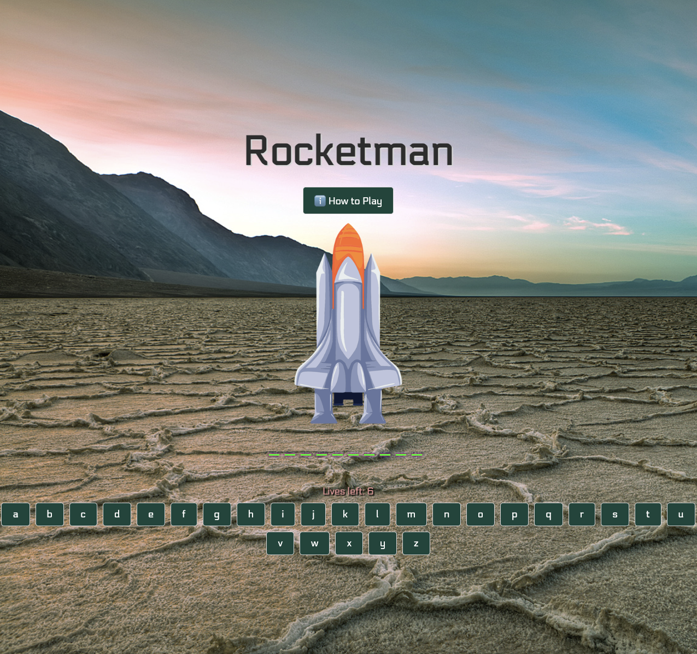
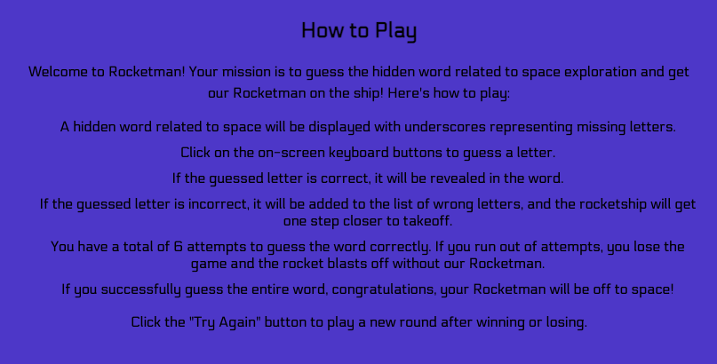
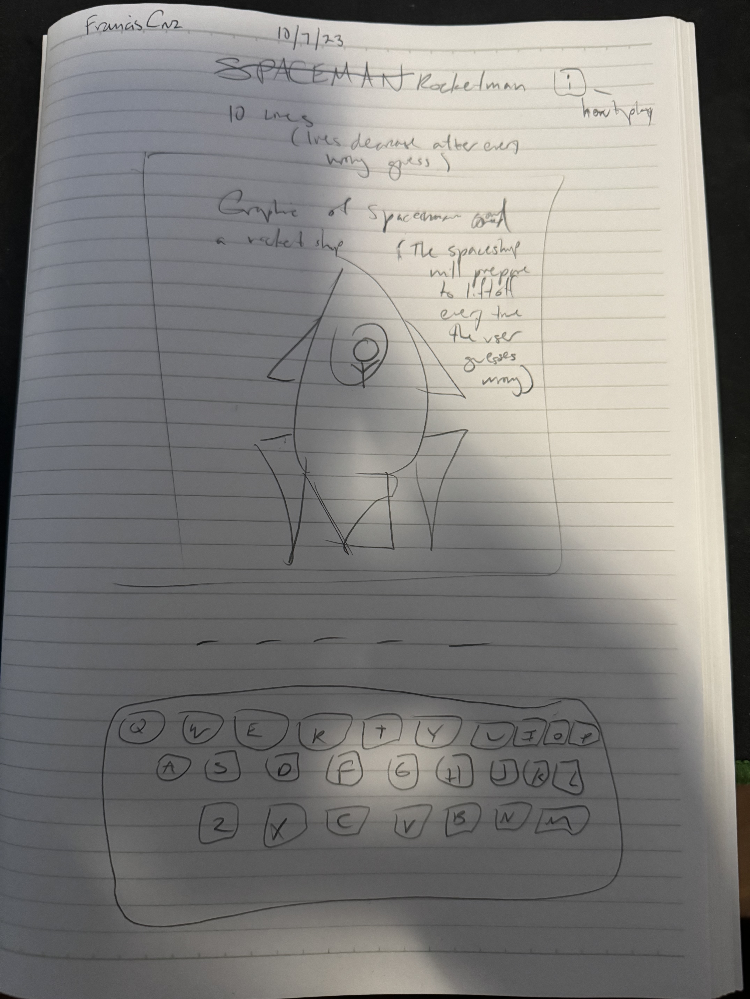

# Rocketman
This is my project called Rocketman! Based on the timeless game of hangman.

# Project Description
Let's get the Rocketman to space! The player has to guess the unknown word with a total of 6 lives. Using letters of the alphabet the player must choose letters that match the given word. If the player fails to guess the word completely within 6 lives the rocket blasts off into space without the rocketman.

# Getting Started

# Initial Wireframe

# Technologies Used
HTML5, CSS, Javascript, Google Fonts

# Next Steps
Implement a feature that will alow the user to choose from a category of words.  
Implement a feature that will display a hint if the word is too hard to guess completely.

# Link to my live project
https://edcarcruz.github.io/rocketman/